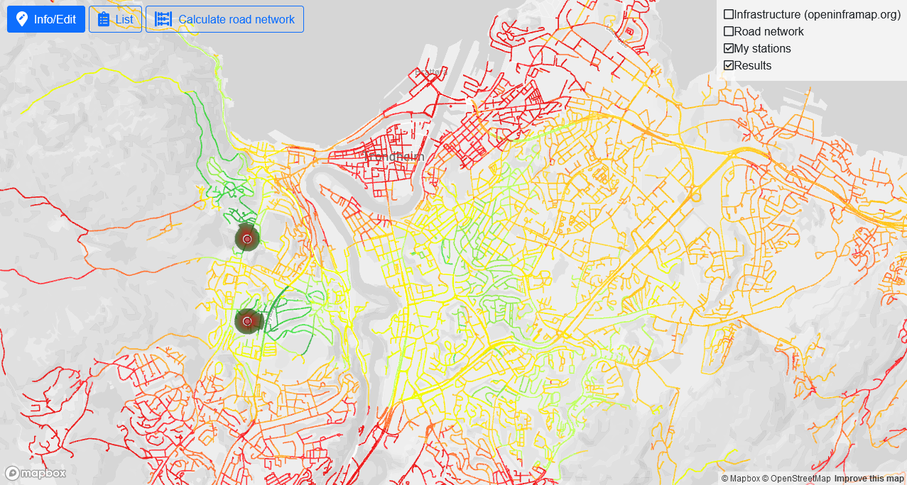

# The online demonstrator

The online demonstrator is meant to be a simple map-based tool for testing the path loss calculations. Base stations can be placed on the map, and the tool can be used to calculate path loss between a selected base station and a certain point on the map, or between selected base stations and the road network.

For long-running calculations with high performance requirements, it is recommended to download the model executable and run it on your own calculation computer, as the current server and queue system may make calculations take a long time. See the 'Offline calculations' section further down.

Warning: The online demonstrator has primarly been tested in Mozilla Firefox and Google Chrome. It will probably work in most modern browsers, but it should not be surprising if there are issues in older browsers such as Internet Explorer.

## Placing new base stations on the map
To place a new station on the map, click on the map where you want to place it, and pick "Create new station at this location" in the context menu that appears. The station will then appear as a gray circle, which will be colorized when it has been saved. Edit the base station parameters as required, and click "Save station" to finalize it.

<video width="840" height="652" controls>
  <source src="docs/create-station.mp4" type="video/mp4">
</video>

<video width="840" height="652">
  <source src="docs/create-station.mp4" type="video/mp4">
</video>

<video>
  <source src="docs/create-station.mp4" type="video/mp4">
</video>

<video width="840" height="652" controls>
  <source src="./docs/create-station.mp4" type="video/mp4">
</video>

<video width="840" height="652">
  <source src="./docs/create-station.mp4" type="video/mp4">
</video>

<video>
  <source src="./docs/create-station.mp4" type="video/mp4">
</video>

## Base station visualization

## Editing existing base stations
## Importing/exporting data
## Picking map layers
## Running path loss calculations from a base station to a point
## Running road network calculations
## Showing results from road network calculations

# Path loss models
## Mobile network
## ITS G5
## Implementing new models

# Station parameters
# Performance
# Offline calculations