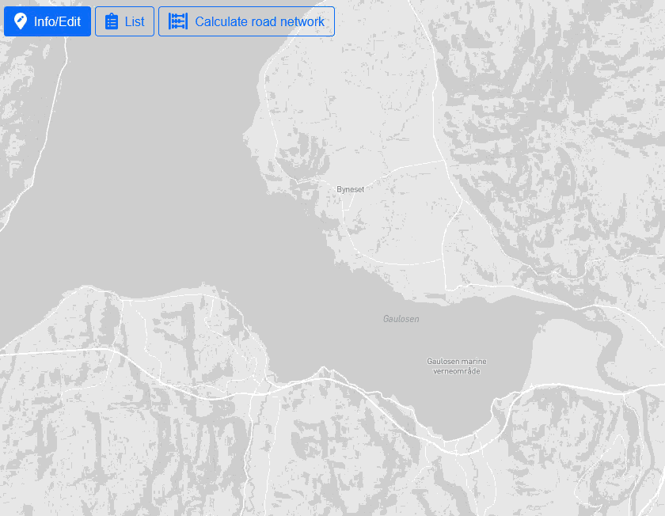
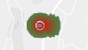
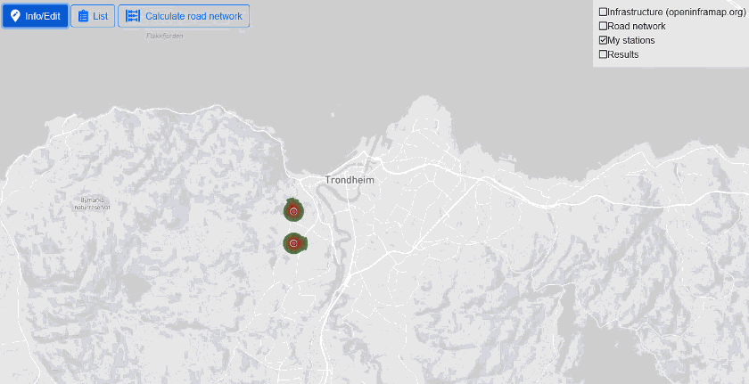
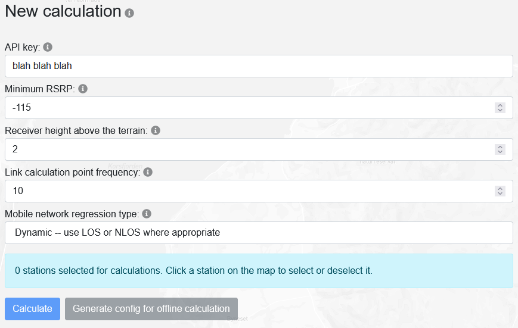
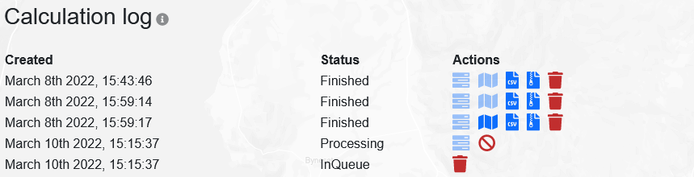
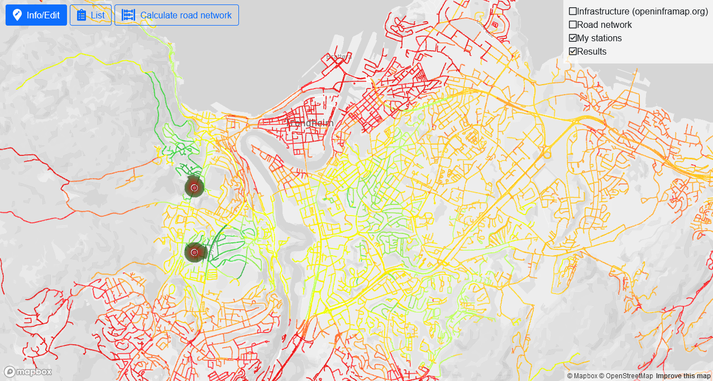
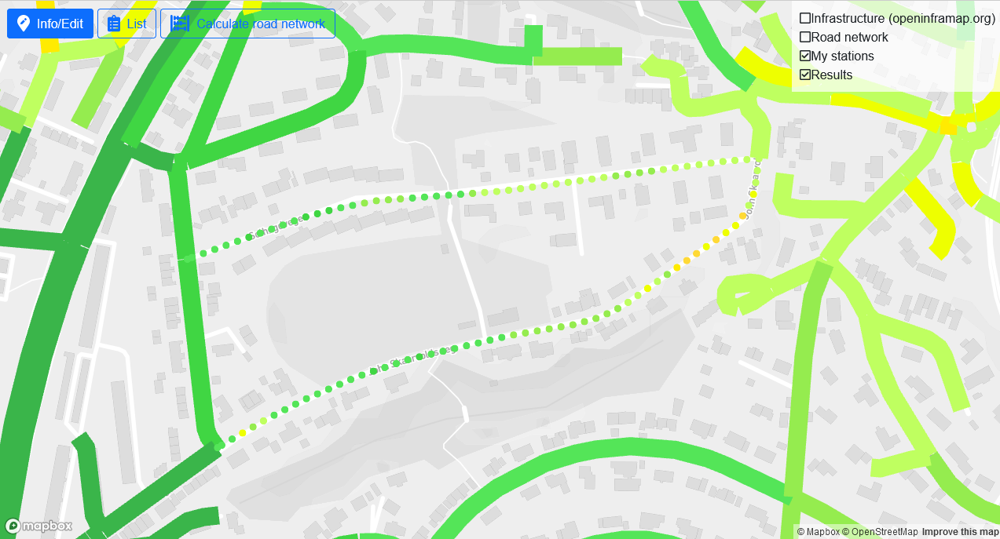

# The LambdaRoad path loss model and online demonstrator

In the LambdaRoad project, two path loss models were created based on collected signal strength data: one for mobile network at 800MHz, and one for ITS G5. Both models have been implemented in a command line application for calculating path loss along the road network. A web based map tool was created to demonstrate the path loss models, and allow easy experimentation and testing.

*In general, hold your mouse over something in the tool to get a mouseover explanation. The rest of this document explains everything in further detail.*

For long-running calculations with high performance requirements, it is recommended to download the model executable and run it on your own calculation computer, as the current server and queue system may make calculations take a long time. See the 'Offline calculations' section further down.

Warning: The online demonstrator has primarly been tested in Mozilla Firefox and Google Chrome. It will probably work in most modern browsers, but it should not be surprising if there are issues in older browsers such as Internet Explorer.

## User data in the online demonstrator
All base stations you place on the map are saved only in your web browser's local storage. This means that if you switch to another browser or another computer, you will lose your setup. You can export stations and import them in another browser or on another computer, see 'Importing/exporting data'.

If you run a single point calculation, the base station parameters as well as the coordinates of the target point is sent to the server and processed, but nothing is saved anywhere.

If you run a road link calculation, the parameters of all selected base stations are sent to the server, and the relevant parameters are stored as part of the result files. You can manually delete these files by deleting the calculations results in the 'Calculate road network' section of the tool.

If you do not want to send any data to our server, you can run the entire calculation offline instead. See the 'Offline calculations' section below.

## What is a "base station" in this tool?
In the current implementation of the tool, a "base station" is actually more like an "antenna" -- it is a single signal source. If you need to simulate a base station with multiple antennas, you must zoom in as much as you can and place the antennas very close to each other, or use offline calculations where you can define multiple "base stations" on the same coordinate.

## Placing new base stations on the map
To place a new station on the map, click on the map where you want to place it, and pick "Create new station at this location" in the context menu that appears. The station will then appear as a gray circle, which will be colorized when it has been saved. Edit the base station parameters as required, and click "Save station" to finalize it.

Hold your mouse over the parameter headers in the tool for explanations.

## Base station visualization
Base stations are visualized as a circle with a surrounding signal strength indicator depending on their combined power and gain.

The center circle is colored depending on the station's state:
 - Red: normal
 - Gray: new/unsaved
 - Green: selected for editing
 - Blue: selected for calculations

The surrounding signal strength indicator will visualize the power+gain for each degree of a circle. The coloring of the signal strength indicator always moves from red to green, with no relevance for the signal strength.

The figure below shows a visualization for a station with a power of 50, and a gain of 18 to 28 around the 0 degree mark (stright East). This station will have a larger RSRP on the right hand side than on the left hand side.

Note that too large signal strengths will be capped at 128 pixels, resulting in the entire indicator being shrunk to fit this size. The visualization can therefore not be used to provide a detailed signal strength comparison, it is meant as a convenient way of quickly visually separating different stations from each other.

## Editing existing base stations
To edit an existing base station, pick "Info/Edit" in menu in the top left corner, then click the station you want to edit. When you are done, remember to click "Save changes", or "Cancel" if you want to undo your current edits.

## Removing base stations
To remove a base station, pick "Info/Edit" in menu in the top left corner, click the station you want to edit, then click "Delete station" below the editor. This cannot be undone.

## Importing/exporting data
To import base stations to the tool, you can use the "List" item in the menu in the upper left corner, and click "Import CSV". This allows you to import a simple CSV format with the parameters used in this tool.

To export base stations as CSV, click "Export CSV" at the bottom of the station list. This exports data in the same CSV format as above.

## Picking map layers
In addition to your base stations and calculation results, you can also toggle layers showing infrastructure (from infrastructure.org) or the road network used in the road network calculations using the layer picker in the upper right corner. Click a layer to turn it on or off. For all layers, you can hold your mouse over an element on the map to get further information.

## Running path loss calculations from a base station to a point
To run a path loss calculation from a base station to a point on the map, you need to select a base station first. Pick "Info/Edit" in menu in the top left corner, then click the station you want to calculate from. When a station is selected (green center circle), you can click anywhere on the map and select "Calculate path loss from (station name)".

For performance reasons, a maximum of 1000 points are visualized in the plot. If the distance is greater than 1000 meters, a regular number of points are skipped between each visualized point, so that the number of points does not exceed 1000. In these cases, the distance between each visualized point will therefore be more than 1 meter. For more detail, the complete results can be exported as CSV.

Note that results are reported as RSRP, but if this is an ITS G5 station, it corresponds to a simplified RSSI (the same calculation as for RSRP, but without the resource block term). See the 'RSRP vs RSSI in the results' for more about this.

## Running road network calculations
A road network calculation is a calculation where the received signal strength from one or more base stations is calculated along all roads within the base station's range.

Before starting a road network calculation, you need to input an API key, and consider the calculation parameters, as shown below. You will also need to select which base stations you want to include in this calculation.

**Step 1:** A road network calculation starts with all road links within the maximum radius (defined on each base station) of each base station being read into memory, and connected so that each base station has a list of all relevant links. One road link may be in the list of multiple base stations. 

**Step 2:** Then each base station processes all its links once with an algorithm for finding the lowest possible path loss (assuming a perfectly flat terrain) to each point in this link. If the RSRP based on the lowest possible path loss is lower than the minimum RSRP (defined in the calculation parameters), this link will not be processed at all, as it is guaranteed to be removed after the calculation anyway (step 4).

**Step 3:** The next step is the actual path loss calculation. Each base station runs through all its links once more, this time retrieving detailed terrain profiles between the base station and each point on the road network, calculating path loss and RSRP for each point. If the link calculation point frequency (defined in the calculation parameters) is 1, this will happen for every meter along the road link. If it is 10, it will happen for every 10th meter, making the calculation much faster, but also less detailed.

**Step 4:** To save storage space, all links with no points with an RSRP above the minimum RSRP (defined in the calculation parameters) are removed.

**Step 5:** The results are stored in various formats to allow visualization in the map and downloads as CSV and SHP.

Since these calculations are a lot more time consuming than a single point calculation (often requiring billions of terrain lookups per base station), the calculation jobs are listed in "Calculation log", where you can see calculation progress and results when it's finished. Due to limitations on our server, only a single calculation can run at a time, which means that a job may be placed in a queue to be calculated when the current job is finished.

A job in the queue can be deleted by clicking the trash can (it will be removed from your list and from the queue on the server). 
A job that is currently being processed can be aborted by clicking the stop symbol (it will be stopped, but the configuration and progress information will remain until you delete the job).
A finished job can be deleted by clicking the trash can (it will be removed from your list, and all results will be deleted from our server). 

When a job has finished, results can be downloaded as CSV or SHP files, both containing details of the path loss from each base station to each point along each calculated road link. Results can also be visualized on the map by clicking the map symbol. A calculation result may look like shown below. Note in the rightmost image that it is possible to zoom in and click a link to split it into all the individual points it consists of. The number of points will depend on the link calculation point frequency.

|   |   |
|---|---|
 | 

## RSRP vs RSSI in the results

## Performance
As the application has to retrieve and process a one meter resolution height profile of up to tens of kilometers for every single point it has to calculate, there has been a large focus on performance. Elevation data is downloaded (either manually or on demand), then converted to an optimized file format to allow very quick file loading. Elevation data is stored in tiles of 512x512 meters, which was found in testing to be a good balance between size (less tiles must be loaded in to memory) and memory usage (less total data has to be loaded into memory). Since multiple tiles may have to be loaded into memory to retrieve a single height profile, the road link calculation orders the links by the angle between the West-East line and the line from the base station to the center point of the road link. This means that links using the same tiles are calculated after each other, lowering the amount of tiles that must be loaded into memory multiple times.

## Offline calculations
The online map tool sends data to the server, which runs the command line application. Like the online tool, the command line application is also open source, and can be compiled with or without modifications, or downloaded as a compiled executable if you need to run offline calculations.

Offline calculations are generally more performant than the online applications, both because there is no calculation queue, and because the application for some reason is about twice as fast when compiled as a standalone executable as compared to a part of an ASP.NET REST API. Offline calculations can also be easier to set up for complex calculations, as you have full control of the config-file the application runs.

# The command line application
The command line application is a .NET Standard application written in C#. It consists of two path loss models (mobile network 800MHz and ITS G5), as well as a framework for running path loss calculations on a road network, in a grid, or to a single point. It also includes a tool for extracting elevation data from Hoydedata.no and converting it to a more performant custom binary format for speedy calculations.

## Calculation modes
### Road network
### Grid
### Single point
## Path loss models
### Mobile network
### ITS G5
### Implementing new models
## Elevation data
