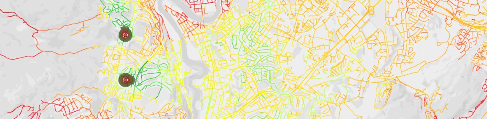

# The LambdaRoad path loss model and online demonstrator

In the LambdaRoad project, two path loss models were created based on collected signal strength data: one for mobile network at 800MHz, and one for ITS G5. Both models have been implemented in a command line application for calculating path loss along the road network. A web based map tool was created to demonstrate the path loss models, and allow easy experimentation and testing.



*In general, hold your mouse over something in the tool to get a mouseover explanation. The rest of this document explains everything in further detail.*

For long-running calculations with high performance requirements, it is recommended to download the model executable and run it on your own calculation computer, as the current server and queue system may make calculations take a long time. See the 'Offline calculations' section further down.

Warning: The online demonstrator has primarly been tested in Mozilla Firefox and Google Chrome. It will probably work in most modern browsers, but it should not be surprising if there are issues in older browsers such as Internet Explorer.

## User data in the online demonstrator
All base stations you place on the map are saved only in your web browser's local storage. This means that if you switch to another browser or another computer, you will lose your setup. You can export stations and import them in another browser or on another computer, see 'Importing/exporting data'.

If you run a single point calculation, the base station parameters as well as the coordinates of the target point is sent to the server and processed, but nothing is saved anywhere.

If you run a road link calculation, the parameters of all selected base stations are sent to the server, and the relevant parameters are stored as part of the result files. You can manually delete these files by deleting the calculations results in the 'Calculate road network' section of the tool.

If you do not want to send any data to our server, you can run the entire calculation offline instead. See the 'Offline calculations' section below.

## What is a "base station" in this tool?
In the current implementation of the tool, a "base station" is actually more like an "antenna" -- it is a single signal source. If you need to simulate a base station with multiple antennas, you must zoom in as much as you can and place the antennas very close to each other, or use offline calculations where you can define multiple "base stations" on the same coordinate.

## Placing new base stations on the map
To place a new station on the map, click on the map where you want to place it, and pick "Create new station at this location" in the context menu that appears. The station will then appear as a gray circle, which will be colorized when it has been saved. Edit the base station parameters as required, and click "Save station" to finalize it.

Hold your mouse over the parameter headers in the tool for explanations.


## Base station visualization
Base stations are visualized as a circle with a surrounding signal strength indicator depending on their combined power and gain.

The center circle is colored depending on the station's state:
 - Red: normal
 - Gray: new/unsaved
 - Green: selected for editing
 - Blue: selected for calculations

The surrounding signal strength indicator will visualize the power+gain for each degree of a circle. The coloring of the signal strength indicator always moves from red to green, with no relevance for the signal strength.

The figure below shows a visualization for a station with a power of 50, and a gain of 18 to 28 around the 0 degree mark (stright East). This station will have a larger RSRP on the right hand side than on the left hand side.


Note that too large signal strengths will be capped at 128 pixels, resulting in the entire indicator being shrunk to fit this size. The visualization can therefore not be used to provide a detailed signal strength comparison, it is meant as a convenient way of quickly visually separating different stations from each other.

## Editing existing base stations
To edit an existing base station, pick "Info/Edit" in menu in the top left corner, then click the station you want to edit. When you are done, remember to click "Save changes", or "Cancel" if you want to undo your current edits.

## Removing base stations
To remove a base station, pick "Info/Edit" in menu in the top left corner, click the station you want to edit, then click "Delete station" below the editor. This cannot be undone.

## Importing/exporting data
To import base stations to the tool, you can use the "List" item in the menu in the upper left corner, and click "Import CSV". This allows you to import a simple CSV format with the parameters used in this tool.

To export base stations as CSV, click "Export CSV" at the bottom of the station list. This exports data in the same CSV format as above.

## Picking map layers
In addition to your base stations and calculation results, you can also toggle layers showing infrastructure (from infrastructure.org) or the road network used in the road network calculations using the layer picker in the upper right corner. Click a layer to turn it on or off. For all layers, you can hold your mouse over an element on the map to get further information.

## Running path loss calculations from a base station to a point
To run a path loss calculation from a base station to a point on the map, you need to select a base station first. Pick "Info/Edit" in menu in the top left corner, then click the station you want to calculate from. When a station is selected (green center circle), you can click anywhere on the map and select "Calculate path loss from (station name)".


For performance reasons, a maximum of 1000 points are visualized in the plot. If the distance is greater than 1000 meters, a regular number of points are skipped between each visualized point, so that the number of points does not exceed 1000. In these cases, the distance between each visualized point will therefore be more than 1 meter. For more detail, the complete results can be exported as CSV.

Note that results are reported as RSRP, but if this is an ITS G5 station, it corresponds to a simplified RSSI (the same calculation as for RSRP, but without the resource block term). See the 'RSRP vs RSSI in the results' for more about this.

## Running road network calculations
A road network calculation is a calculation where the received signal strength from one or more base stations is calculated along all roads within the base station's range.

Before starting a road network calculation, you need to input an API key, and consider the calculation parameters, as shown below. You will also need to select which base stations you want to include in this calculation.


**Step 1:** A road network calculation starts with all road links within the maximum radius (defined on each base station) of each base station being read into memory, and connected so that each base station has a list of all relevant links. One road link may be in the list of multiple base stations. 

**Step 2:** Then each base station processes all its links once with an algorithm for finding the lowest possible path loss (assuming a perfectly flat terrain) to each point in this link. If the RSRP based on the lowest possible path loss is lower than the minimum RSRP (defined in the calculation parameters), this link will not be processed at all, as it is guaranteed to be removed after the calculation anyway (step 4).

**Step 3:** The next step is the actual path loss calculation. Each base station runs through all its links once more, this time retrieving detailed terrain profiles between the base station and each point on the road network, calculating path loss and RSRP for each point. If the link calculation point frequency (defined in the calculation parameters) is 1, this will happen for every meter along the road link. If it is 10, it will happen for every 10th meter, making the calculation much faster, but also less detailed.

**Step 4:** To save storage space, all links with no points with an RSRP above the minimum RSRP (defined in the calculation parameters) are removed.

**Step 5:** The results are stored in various formats to allow visualization in the map and downloads as CSV and SHP.

Since these calculations are a lot more time consuming than a single point calculation (often requiring billions of terrain lookups per base station), the calculation jobs are listed in "Calculation log", where you can see calculation progress and results when it's finished. Due to limitations on our server, only a single calculation can run at a time, which means that a job may be placed in a queue to be calculated when the current job is finished.

A job in the queue can be deleted by clicking the trash can (it will be removed from your list and from the queue on the server). 
A job that is currently being processed can be aborted by clicking the stop symbol (it will be stopped, but the configuration and progress information will remain until you delete the job).
A finished job can be deleted by clicking the trash can (it will be removed from your list, and all results will be deleted from our server). 


When a job has finished, results can be downloaded as CSV or SHP files, both containing details of the path loss from each base station to each point along each calculated road link. Results can also be visualized on the map by clicking the map symbol. A calculation result may look like shown below. Note in the rightmost image that it is possible to zoom in and click a link to split it into all the individual points it consists of. The number of points will depend on the link calculation point frequency.

|   |   |
|---|---|
 | 

## RSRP vs RSSI in the results
The RSSI, which was used when collecting data in the LambdaRoad project, contains the total received signal energy over the entire bandwidth of the signal, including the signal of interest, noise and interference. While this is a good value to use when collecting data, it is difficult to estimate since noise and interference is not a part of the model. The RSRP contains the average received signal level per resource element of the LTE signal. Therefore, the RSRP is a better parameter to use when estimating the path loss than the RSSI.

This means that the tool is focused on RSRP, but for ITS G5 it has to report a suboptimal RSSI calculation, since it is a WiFi technology without resource blocks.

## Performance
As the application has to retrieve and process a one meter resolution height profile of up to tens of kilometers for every single point it has to calculate, there has been a large focus on performance. Elevation data is downloaded (either manually or on demand), then converted to an optimized file format to allow very quick file loading. Elevation data is stored in tiles of 512x512 meters, which was found in testing to be a good balance between size (less tiles must be loaded in to memory) and memory usage (less total data has to be loaded into memory). Since multiple tiles may have to be loaded into memory to retrieve a single height profile, the road link calculation orders the links by the angle between the West-East line and the line from the base station to the center point of the road link. This means that links using the same tiles are calculated after each other, lowering the amount of tiles that must be loaded into memory multiple times.

## Offline calculations
The online map tool sends data to the server, which runs the command line application. Like the online tool, the command line application is also open source, and can be compiled with or without modifications, or downloaded as a compiled executable if you need to run offline calculations.

Offline calculations are generally more performant than the online applications, both because there is no calculation queue, and because the application for some reason is about twice as fast when compiled as a standalone executable as compared to a part of an ASP.NET REST API. Offline calculations can also be easier to set up for complex calculations, as you have full control of the config-file the application runs.

# The command line application
The command line application is a .NET Standard application written in C#. It consists of one solution containing four projects:

 - LambdaModel is a library containing most of the code.
 - LambdaModel.Tests is a set of unit tests for various parts of the LambdaModel code.
 - LambdaModelRunner is the command line application utilizing the above library to run calculations using a configuration file.
 - LambdaRestApi is the REST API that serves as a backend for the web-based map tool.

There are currently two implemented path loss models (mobile network 800MHz and ITS G5), as well as a framework for running path loss calculations on a road network, in a grid, or to a single point. It also includes methods for preprocessing elevation data from Hoydedata.no (or other equivalent sources) and converting it to a custom binary format that is quicker to read, ensuring speedy calculations.

The application is run by dragging a config file onto its file icon in Windows Explorer (LambdaModelRunner.exe), or by running LambdaModelRunner.exe 'path\to\some\config.json'.

## Calculation modes
The application can handle two different types of config files, either for running a road network calculation, or for running an elevation data pre-processing. In addition, the application can run grid calculations and single point calculations, but these have not been the focus of the LambdaRoad project, and there has not been implemented a config entry point for them. A user competent in C# would be able to run them anyway, with some modifications to the application.

### Road network
A road network calculation is a calculation where the received signal strength from one or more base stations is calculated along all roads within the base station's range.

Road network calculations are described in detail in the section 'Running road network calculations' above.

The JSON below shows an example of a config file for a road network calculation:

```json
{
    /* Which type of operation this log file runs. Can be either RoadNetwork, Grid or GenerateTiles. */
    "Operation": "RoadNetwork",              

    /* A shape-file that contains the road network. Can be absolute or relative to the config location. */
    "RoadShapeLocation": "2021-05-28.shp",   

    /* How many meters between each point on a road link that is calculated. 
       The lowest possible value is 1. A higher value will result in a more detailed result, but longer 
       calculation times. 
       The first and last point on the road link is guaranteed to be calculated even if this value is 
       larger than the length of the link. */
    "LinkCalculationPointFrequency": 10,
                                             

    /* The regression formula used in path loss calculations for the mobile network has three different 
       sets of constants. Possible values are:                                             
           'All' is trained on all values in the test set, 
           'LineOfSight' is trained on values with line of sight, 
           'NoLineOfSight' is trained on values without line of sight. 
           'Dynamic' will automatically pick either LOS or NLOS constants depending on whether the current 
               path loss calculation has line of sight or not. */
    "MobileRegression": "Dynamic",
    
    /* The height of the receiver above the terrain (meters). */
    "ReceiverHeightAboveTerrain": 2,      

    /* The minimum accepted RSRP. Any road links with a guaranteed lower RSRP than this (calculated 
       using horizontal and vertical distances) will be excluded from the calculation. Any road links
       with a lower RSRP than this will be excluded from the results. 
       A higher value will result in much faster calculations and a smaller result file size. */
    "MinimumAllowableRsrp": -115,            
                                             

    /* How many threads that can be used to run calculation. 
       If set to null, the number of threads will automatically be determined based on the number of 
       processing cores. N threads means N times as much memory usage, so if you experience memory problems,
       try setting this to a low number. There will never be more threads than base stations(one thread
       processes one base station at a time). */
    "CalculationThreads": null,              
                                             
    /* A list (array, []) of all base stations to be included in this calculation. */
    "BaseStations": [                        
        {
            /* A unique ID for this base station. Must be unique across this configuration file. */
            "id": "1254",                    
            /* A name for this base station. Does not have to be unique. Only used in progress presentation. */
            "name": "Mob1",                  
            
            "center": {
                /* X-coordinate in UTM 33N (EPSG 25833, https://epsg.io/map#srs=25833) */
                "x": 268283.4066450454,      
                /* Y-coordinate in UTM 33N */
                "y": 7040847.668103122       
            },
            
            /* How many meters above the terrain this antenna is placed. */
            "heightAboveTerrain": 12,        

            /* The radius around this station that it is necessary for the road link calculation to consider 
               road links. A higher radius prolongs the calculation time, as more road links must be considered. */
            "maxRadius": 10000,              

            /* The type of antenna. Can be either MobileNetwork for mobile network signals (800MHz) or ItsG5 
               for ITS G5. */
            "antennaType": "MobileNetwork",  

            /* The (directional) gain of this station. 
               It can be a single number for constant gain in all directions, or a sector definition for 
               different gain in different directions. 
               Constant example: '10' (10 Db all around the station)
               Angle dependent example: '-45:45:18|45:60:7' (18 Db between -45 and 45 degrees, and 7 Db between
               45 and 60 degrees).
               Default value if undefined: 0 (all around the station) */
            "gainDefinition": "125:140:5|90:125:25|65:90:15|40:65:4", 
            
            /* The base transmit power of this station. It is equal in all directions.
               For RSRP calculations, power and (directional) gain is added before subtracting the different losses. */
            "power": 46,                     

            /* Used in RSRP and RSSI calculations -- this value is subtracted from the sum of power and gain, 
               before the path loss is calculated and subtracted.
               Default value if undefined: 2 */
            "cableLoss": 2,                  

            /* Used in RSRP and RSSI calculations -- this value is subtracted from the sum of power and gain, 
               before the path loss is calculated and subtracted.
               If undefined or set to null, it will be automatically set depending on antenna type (10log(50)
               for MobileNetwork, and 0 for ItsG5. */
            "resourceBlockConstant": null    
                                             
        },
        /* A few more station examples: */
        {
            "id": "1255",
            "name": "Its2151",
            "center": {
                "x": 268283.4066450454,
                "y": 7040847.668103122 
            },
            "heightAboveTerrain": 3, 
            "maxRadius": 5000,
            "antennaType": "ItsG5",
            "power": 42,
        },
        {
            "id": "1256b",
            "name": "Another station",
            "center": {
                "x": 268283.4066450454,
                "y": 7040847.668103122 
            },
            "heightAboveTerrain": 3,
            "maxRadius": 5000,
            "antennaType": "ItsG5",
            "power": 15
        }
    ],

    /* The directory where you want results to be stored. */
    "OutputDirectory": "..\\RoadNetwork",    

    /* If set to true, a shape file containing each calculated point and its results will be written
       to the results directory. */
    "WriteShape": true,                      
    /* The filename of the shape file that is written if WriteShape is true. */
    "ShapeFileName": "results.shp",          

    /* If set to true, a CSV file containing each calculated point and its results will be written
       to the results directory. */
    "WriteCsv": true,                        
    /* The filename of the CSV file that is written if WriteCsv is true. */
    "CsvFileName": "results.csv",            
    /* The separator between columns in the CSV file. */
    "CsvSeparator": ";",                     

    /* If set to true, a log file containing information about the calculation process will be written
       to the results directory. */
    "WriteLog": true,                        
    /* The filename of the log file that is written if WriteLog is true. */
    "LogFileName": "log.json",               

    /* If set to true, various API result files will be written. The most important part of this is a 
       GeoJSON file containing the data that can be displayed on the web-based map. */
    "WriteApiResults": false,                
    /* The name of the API results directory that will be written inside the results directory. */
    "ApiResultInnerFolderName": "links",     

    /* Settings for where elevation data is stored. */
    "Terrain":                               
    {
        /* Using an online cache means that the application will download tiles as requiered, convert them
           to an optimized binary format, then store them in the defined location. This means that the 
           application will spend a lot of time downloading elevation data every time you run it for a new
           geographic area. 
           You can use "LocalCache" if you have prepared elevation data yourself (see the 'Elevation data'
           section in the documentation). This mode will only use already downloaded data. */
        "Type": "OnlineCache",               
        /* Dynamic url to elevation data WMS (allows downloading TIFF-files with elevation for the area 
           defined in the url parameters). */
        "WmsUrl": "https://wms.geonorge.no/skwms1/wms.hoyde-dom?bbox={0}&format=image/tiff&service=WMS&version=1.1.1&request=GetMap&srs=EPSG:25833&transparent=true&width={1}&height={2}&layers=dom1_33:None", 
        /* Path where elevation data will be read from (and downloaded to if OnlineCache). A fast and 
           large SSD is recommended. */
        "Location": "I:\\Lambda\\Tiles_512", 
        /* Setting for memory handling. This sets how many tiles can be kept in memory at the same time.
           Too high number, and the application will crash when it is out of memory. Too low, and the
           application will have to read files over and over again, resulting in longer calculation times. */
        "MaxCacheItems": 300,                
        /* Setting for memory handling. This sets how many of the least recently used tiles that are 
           removed once the memory cache has been filled. */
        "RemoveCacheItemsWhenFull": 100,     
        /* The size of elevation data tiles that is used in this calculation. 512 is a good balance between
           small files where a lot of them has to be opened, but they can be opened very quickly, and large
           files that cover a larger area, takes a longer time to open, but a fewer number of files has to be opened. */
        "TileSize": 512,                     
    }
}
```

### Grid
### Single point
## Path loss models
### Mobile network
### ITS G5
### Implementing new models
## Elevation data
